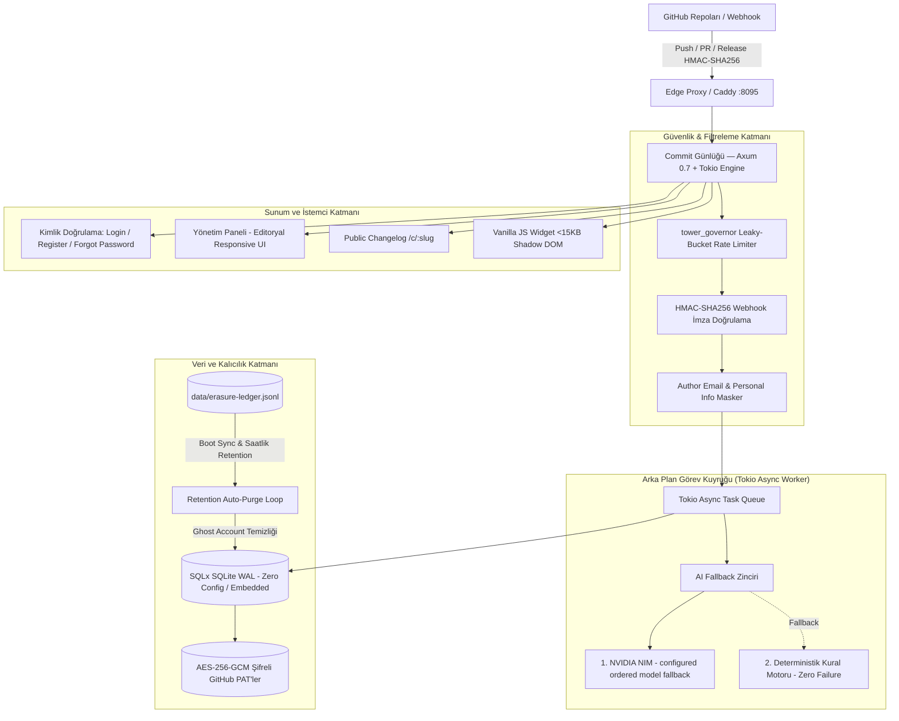

<div align="center">

# Commit Günlüğü ⚡

**GitHub commit ve PR hareketlerinizden editoryal, kullanıcı dostu sürüm günlüğü (changelog) üreten ultra hızlı Rust motoru.**

[](LICENSE)
[](https://www.rust-lang.org/)
[](https://github.com/tokio-rs/axum)
[](https://github.com/settings/developer_program)
[](https://commit.dixtuel.tr)

*Sub-millisecond webhook ingestion, 3 kademeli dayanıklı AI özetleme zinciri, KVKK uyumlu yerel imha kütüğü ve otomatik süpürücü (retention loop), at-rest AES-256-GCM token şifreleme ve <15KB Shadow DOM gömülebilir widget.*

[Canlı Demo](https://commit.dixtuel.tr) • [Mimari](#-sistem-mimarisi) • [Özellikler](#-temel-özellikler) • [Güvenlik ve KVKK](#-güvenlik-gizlilik-ve-kvkk-standartları) • [Widget Kullanımı](#-gömülebilir-widget-kullanımı-15kb) • [Kurulum](#-yerel-geliştirme-ve-kurulum)

---

</div>

## 🚀 Neden Commit Günlüğü?

Yazılım geliştiriciler kod üretir, ancak son kullanıcılar teknik git commit mesajlarını (`fix(auth): resolve JWT expiration bug in middleware`) anlamaz. **Commit Günlüğü**, GitHub deponuza gelen webhook olaylarını dinler, teknik commit ve PR metinlerini analiz eder ve çok kademeli yapay zeka zinciriyle doğrudan kullanıcı deneyimine hitap eden editoryal sürüm notlarına dönüştürür.

- ⚡ **Ultra Düşük Kaynak Tüketimi:** Node.js (~350MB) ve Python (~250MB) yerine Rust (Axum + Tokio + SQLite WAL) ile yalnızca **~15MB RAM** tüketir.
- ⏱️ **Sub-Millisecond Webhook Yanıtı:** Webhook isteklerini <2ms sürede karşılayıp 200 OK döner; AI özetleme görevini arka plandaki asenkron Tokio worker kuyruğunda yürütür.
- 🧠 **2 Kademeli AI Fallback Zinciri:** NVIDIA NIM &rarr; Sıfır arıza garantili Deterministik Conventional Commits kural motoru.
- 🛡️ **Tavizsiz Güvenlik & DoS Koruması:** Sabit zamanlı HMAC-SHA256 doğrulama, Leaky-Bucket IP hız kısıtlaması (`tower_governor`), SQL injection bağışıklığı.
- 🔒 **KVKK & E-posta Maskeleme:** Ham webhook verilerindeki `author.email` ve kişisel e-postalar işleme kapısında ayıklanır; kamuya açık changelog'a asla sızdırılmaz.
- 🗄️ **Kendi Kendini Onaran KVKK İmha Kütüğü & Retention Süpürücüsü:** Kullanıcı hesabını sildiğinde veritabanından kalıcı olarak silinir (`ON DELETE CASCADE`) ve silinme kaydı `data/erasure-ledger.jsonl` kütüğüne yazılır. Felaket kurtarma anında eski bir SQLite yedeğinden dönülse dahi sunucu açılışında ve saatlik periyodik arka plan döngüsünde dirilen "hayalet" hesaplar otomatik olarak süpürülür.
- 🔐 **At-Rest Token Şifreleme:** Kullanıcıların özel repoları için girdiği GitHub PAT'leri `TOKEN_ENCRYPTION_KEY` ile AES-256-GCM kullanılarak şifrelenmiş biçimde saklanır.
- ✉️ **Opsiyonel SMTP ile Şifre Sıfırlama:** `SMTP_HOST` tanımlandığında (Postfix, SendGrid vb.) şifre sıfırlama bağlantıları gerçek e-posta ile gönderilir; tanımlanmadığında bağlantı sunucu konsoluna güvenle yazdırılır.
- 📱 **Mobil-Öncelikli, Sekmeli Panel:** Yönetim paneli Genel Bakış / Depolar / Entegrasyonlar / Hesap Ayarları sekmelerine ayrılmıştır; dar ekranlarda sekmeler native dropdown'a düşer, modallar tam ekran açılır.
- 📦 **Gömülebilir Hafif Widget:** &lt;15KB Vanilla JS ve Shadow DOM ile ana sitenizin CSS stilleriyle çakışmadan tek satır script ile entegre edilir.

---

## 🏛️ Sistem Mimarisi



---

## 🛠️ Teknoloji Yığını

| Katman | Teknoloji | Açıklama |
| :--- | :--- | :--- |
| **Web Çerçevesi** | Axum 0.7 & Tokio 1 | Yüksek performanslı asenkron HTTP sunucusu |
| **Veritabanı** | SQLite (WAL Mode) & SQLx 0.8 | Sıfır konfigürasyonlu, ACID uyumlu, dosya tabanlı güvenli depolama |
| **Şablon Motoru** | Minijinja 2 | Sıfır bağımlılıklı, güvenli SSR HTML motoru |
| **Kimlik Doğrulama** | Argon2id & HttpOnly Cookies | OWASP standartlarında parola hashleme ve kriptografik oturum yönetimi |
| **Hız Sınırlayıcı** | Tower Governor 0.4 | Smart-IP tabanlı Leaky-Bucket DoS ve brute-force koruması |
| **İmza Doğrulama** | HMAC-SHA256 & Subtle 2.6 | Zamanlama saldırılarına karşı sabit zamanlı (constant-time) doğrulama |
| **Veri İmhası** | KVKK Erasure Ledger & Retention Loop | SQLite yedeğinden dönülse dahi silinen kullanıcıların dirilmesini önleyen bağımsız döngü |
| **Token Şifreleme** | AES-256-GCM (`aes-gcm` crate) | Kullanıcıların özel GitHub PAT'lerini at-rest şifreler |
| **E-posta** | `lettre` (opsiyonel SMTP) | Şifre sıfırlama bağlantısını gerçek e-postayla gönderir |

---

## 📦 Gömülebilir Widget Kullanımı (&lt;15KB)

Web sitenize veya uygulamanıza yenilikler bildirim rozetini eklemek için tek bir `<script>` etiketi yeterlidir:

```html
<!-- Web sitenizin <body> etiketinin sonuna ekleyin -->
<script src="https://commit.dixtuel.tr/static/js/widget.js" data-key="WIDGET_KEYINIZ" async></script>
```

- **Shadow DOM İzolasyonu:** Sitenizin global stilleri widget'ın içini bozmaz; widget stilleri de sayfanıza taşmaz.
- **Okunmadı Sayacı:** Ziyaretçinin son ziyaret zamanını tarayıcının `localStorage` alanında saklar ve henüz okunmamış güncelleme adedini rozet üzerinde gösterir.
- **Duyarlı Tasarım (Mobile-First):** Dar ekranlarda taşma yapmadan tam ekran veya alt panel görünümüne adapte olur.

---

## 🛡️ Güvenlik, Gizlilik ve KVKK Standartları

1. **GitHub Webhook Doğrulaması:** GitHub'dan gelen tüm bildirimler `X-Hub-Signature-256` başlığı üzerinden gizli anahtarla doğrulanır. Zamanlama saldırılarını (timing attack) engellemek amacıyla `subtle::ConstantTimeEq` kullanılır.
2. **Kişisel E-posta Maskeleme:** Ham commit verilerinde yer alan `author.email` ve `committer.email` adresleri işleme kapısında ayıklanır; kamuya açık changelog (`/c/:slug`) veya widget JSON çıktısına asla sızdırılmaz.
3. **KVKK Uyumlu Hesap İmhası & Retention Kütüğü:** Kullanıcı hesabını sildiğinde tüm ilişkili projeleri ve verileri veritabanından kalıcı olarak silinir (`ON DELETE CASCADE`). E-posta adresinin SHA-256 özeti `data/erasure-ledger.jsonl` kütüğüne yazılır. Sunucu açılışında ve saatlik periyotlarda çalışan **Retention Worker**, eski bir veritabanı yedeğinden dönülmüş olsa dahi silinmiş hesapları tespit eder ve kalıcı olarak temizler.
4. **Anti-Scraping Kimlik Koruması:** Prodüksiyon arayüzünde yayınlanan veri sorumlusu ve iletişim bilgileri, e-posta kazıyıcı botlara karşı obfuscated DOM enjeksiyonu ve honeypot tuzakları (`identity-guard.js`) ile korunur.
5. **At-Rest Veri Şifreleme & Arama Yapılabilir Kör İndeks (Blind Index):** Kullanıcı e-postaları (`users.email`), kişisel GitHub PAT tokenları ve webhook anahtarları AES-256-GCM ile disk üzerinde şifreli saklanır. E-posta adresleri üzerinde hızlı ve güvenli arama için SHA-256 kör indeksi (`users.email_hash`) kullanılır; veritabanı sızsa dahi hiçbir e-posta açık metin olarak ele geçirilemez. Oturum anahtarları (`sessions.id`) veritabanında SHA-256 ile hashli saklanır.
6. **Koşullu SMTP & Sıfır Gereksiz Bildirim:** `SMTP_HOST` tanımlı olmadığında şifre sıfırlama butonları arayüzden otomatik olarak gizlenir. Şifre sıfırlama taleplerinde kayıtlı olmayan e-postalara kesinlikle mail gönderilmez. Hesap silme işlemlerinde hiçbir e-posta gönderimi tetiklenmez; doğrudan şifre onayıyla anında kalıcı imha yürütülür.
7. **Sıkı Çerez Güvenliği:** Yalnızca oturum için zorunlu `cg_session` çerezi kullanılır (`HttpOnly`, `SameSite=Lax`, `Secure`). Üçüncü taraf reklam ve izleme çerezleri kesinlikle bulunmaz.
8. **Asgari Yetki İlkesi (Least Privilege):** Sunucunun genel `GITHUB_TOKEN` değişkeni yalnızca GitHub API rate limitini yükseltmek içindir ve **hiçbir repo yetkisi gerektirmez**. Kullanıcıların panelden girdiği tokenlar içinse yalnızca ilgili repo üzerinde `Contents: Read-only` iznine sahip Fine-Grained PAT önerilir.

---

## 💻 Yerel Geliştirme ve Kurulum

### Gereksinimler
- Rust 1.80+ (`rustup default stable`)
- SQLite 3

### Adımlar

```bash
# 1. Depoyu klonlayın
git clone https://github.com/dixtuel/commit-gunlugu.git
cd commit-gunlugu

# 2. Ortam değişkenlerini hazırlayın
cp .env.example .env

# 3. Testleri çalıştırın
cargo test

# 4. Geliştirme sunucusunu başlatın
cargo run
```

Sunucu varsayılan olarak `http://127.0.0.1:8095` adresinde dinlemeye başlar.

---

## 🎯 Hızlı Başlangıç (3 Adımda Kullanım)

1. **Hesap Oluşturun:** [commit.dixtuel.tr](https://commit.dixtuel.tr) adresine gidin, hesabınızı oluşturun ve yeni bir proje ekleyin.
2. **GitHub Webhook'unu Ekleyin:** GitHub deponuzun **Settings &rarr; Webhooks** sekmesine giderek size verilen Webhook URL ve Gizli Anahtarı (Secret) yapıştırın, `push` ve `pull_request` olaylarını aktif edin.
3. **Yayınlayın & Gömün:** Yapay zeka tarafından hazırlanan sürüm notlarınızı inceleyin, sitenize tek satır `<script>` widget'ı ekleyerek veya doğrudan `/c/:slug` linkinizi paylaşarak müşterilerinize duyurun!

---

## 📄 Lisans

Bu proje [MIT Lisansı](LICENSE) altında lisanslanmıştır. Kullanılan bağımlılıkların ve açık kaynak kütüphanelerin lisans dökümü için [ATTRIBUTION.md](ATTRIBUTION.md) dosyasına bakabilirsiniz.
