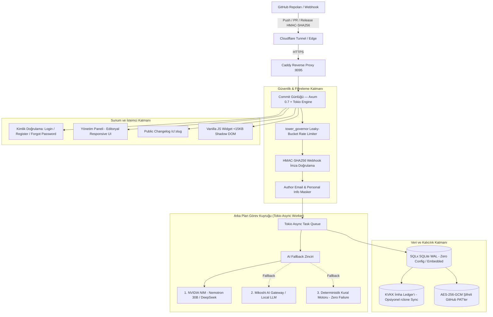

# Commit Günlüğü ⚡

<p align="center">
  
</p>

<p align="center">
  <strong>GitHub commit ve PR hareketlerinizden editoryal, müşteri dostu sürüm günlüğü (changelog) üreten ultra hızlı Rust motoru.</strong>
</p>

<p align="center">
  <a href="https://github.com/dixtuel/commit-gunlugu/blob/main/LICENSE"></a>
  <a href="https://www.rust-lang.org/"></a>
  <a href="https://github.com/tokio-rs/axum"></a>
  <a href="https://github.com/settings/developer_program"></a>
  <a href="https://commit.dixtuel.tr"></a>
</p>

---

## 🚀 Neden Commit Günlüğü?

Geliştiriciler kod yazar, ancak son kullanıcılar teknik git commit mesajlarını (`fix(auth): resolve JWT expiration bug in middleware`) anlamaz. **Commit Günlüğü**, GitHub deponuza gelen webhook olaylarını dinler, teknik commit ve PR metinlerini analiz eder ve çok kademeli yapay zeka zinciriyle son kullanıcının değerini kavrayacağı editoryal sürüm notlarına dönüştürür.

- ⚡ **Ultra Düşük Kaynak Tüketimi:** Node.js (~350MB) ve Python (~250MB) yerine Rust (Axum + Tokio + SQLite WAL) ile yalnızca **~15MB RAM** tüketir.
- ⏱️ **Sub-Millisecond Webhook Yanıtı:** Webhook isteklerini <2ms sürede karşılayıp 200 OK döner; AI özetleme görevini arka plandaki asenkron Tokio worker kuyruğunda yürütür.
- 🧠 **3 Kademeli AI Fallback Zinciri:** NVIDIA NIM &rarr; Mikoshi AI Gateway &rarr; Sıfır hatayla çalışan Deterministik Conventional Commits kural motoru.
- 🛡️ **Tavizsiz Güvenlik & DDoS Koruması:** Sabit zamanlı HMAC-SHA256 doğrulama, Leaky-Bucket IP hız kısıtlaması (`tower_governor`), SQL injection bağışıklığı.
- 🔒 **KVKK & E-posta Maskeleme:** Ham webhook verilerindeki `author.email` ve kişisel e-postalar işleme kapısında ayıklanır; kamuya açık changelog'a asla sızdırılmaz.
- 🗄️ **İmha Ledger'ı & Opsiyonel Bulut Yedek Koruması:** KVKK kapsamında silinen hesaplar bağımsız imha ledger'ına kaydedilir; `R2_ERASURE_REMOTE` ile **kendi** rclone remote'unuzu tanımlarsanız felaket kurtarma senaryosunda eski bir yedekten geri yükleme yapılsa dahi silinmiş hesapların dirilmesini (ghost account) otomatik olarak engeller. Hiçbir paylaşılan/varsayılan bulut kimlik bilgisi projeye gömülü değildir.
- 🔐 **At-Rest Token Şifreleme:** Kullanıcıların özel repo'lar için girdiği GitHub PAT'leri `TOKEN_ENCRYPTION_KEY` ile AES-256-GCM kullanılarak şifrelenmiş biçimde saklanır.
- ✉️ **Opsiyonel SMTP ile Şifre Sıfırlama:** `SMTP_HOST` tanımlarsanız (kendi mail sunucunuz, Postfix, SendGrid, Postmark vb.) şifre sıfırlama bağlantıları gerçek e-posta ile gönderilir; tanımlamazsanız bağlantı yalnızca sunucu logunda görünür.
- 📱 **Mobil-Öncelikli, Sekmeli Panel:** Kontrol paneli Genel Bakış / Depolar / Entegrasyonlar / Hesap Ayarları sekmelerine ayrılmıştır; dar ekranlarda sekmeler native dropdown'a düşer, modallar tam ekran açılır.
- 📦 **Gömülebilir Hafif Widget:** &lt;15KB Vanilla JS ve Shadow DOM ile ana sitenizin CSS stilleriyle çakışmadan tek satır script ile entegre edilir.

---

## 🏛️ Mimari Şeması



---

## 🛠️ Teknoloji Yığını

| Katman | Teknoloji | Açıklama |
| :--- | :--- | :--- |
| **Web Çerçevesi** | Axum 0.7 & Tokio 1 | Yüksek performanslı asenkron HTTP sunucusu |
| **Veritabanı** | SQLite (WAL Mode) & SQLx 0.8 | Sıfır konfigürasyonlu, ACID uyumlu, dosya tabanlı güvenli depolama |
| **Şablon Motoru** | Minijinja 2 | Sıfır bağımlılıklı, güvenli SSR HTML motoru |
| **Kimlik Doğrulama** | Argon2id & HttpOnly Cookies | OWASP standartlarında parola hashleme ve kriptografik oturum yönetimi |
| **Hız Sınırlayıcı** | Tower Governor 0.4 | Smart-IP tabanlı Leaky-Bucket DoS ve brute-force koruması |
| **İmza Doğrulama** | HMAC-SHA256 & Subtle 2.6 | Zamanlama saldırılarına karşı sabit zamanlı (constant-time) doğrulama |
| **Veri İmhası** | KVKK Erasure Ledger & Opsiyonel rclone Sync | Yedekten kurtarma sonrası dahi silinen kullanıcıların dirilmesini önleyen hook |
| **Token Şifreleme** | AES-256-GCM (`aes-gcm` crate) | Kullanıcıların özel GitHub PAT'lerini at-rest şifreler |
| **E-posta** | `lettre` (opsiyonel SMTP) | Şifre sıfırlama bağlantısını gerçek e-postayla gönderir |

---

## 📦 Gömülebilir Widget Kullanımı (&lt;15KB)

Web sitenize veya SaaS ürününüze yenilikler bildirim rozetini eklemek için tek bir `<script>` etiketi yeterlidir:

```html
<!-- Web sitenizin <body> etiketinin sonuna ekleyin -->
<script src="https://commit.dixtuel.tr/static/js/widget.js" data-key="WIDGET_KEYINIZ" async></script>
```

- **Shadow DOM:** Sayfanızdaki CSS stilleri widget'ın içine etki etmez, widget stilleri de sayfanızı bozmaz.
- **Okunmadı Sayacı:** Ziyaretçinin en son ne zaman yenilikleri açtığını `localStorage` üzerinden takip eder ve rozet üzerinde yeni güncelleme sayısını gösterir.
- **Duyarlı (Responsive):** Mobilde ekran genişliğini taşmadan zarif bir popover açar.

---

## 🛡️ Güvenlik, Gizlilik ve KVKK Standartları

1. **GitHub Webhook İmza Doğrulaması:** GitHub'dan gelen tüm payload'lar `X-Hub-Signature-256` başlığı üzerinden gizli anahtarla doğrulanır. Zamanlama saldırılarını engellemek amacıyla `subtle::ConstantTimeEq` kullanılır.
2. **Kişisel E-posta Maskeleme:** Commit mesajlarında veya yazar üst verilerinde yer alan `author.email` ve `committer.email` adresleri kapıda ayıklanır, public changelog (`/c/:slug`) veya widget JSON çıktısına asla sızdırılmaz.
3. **KVKK Uyumlu Hesap Silme & İmha Ledger'ı:** Kullanıcı hesabını sildiğinde tüm ilişkili projeleri ve verileri veritabanından kalıcı olarak silinir (`ON DELETE CASCADE`). E-posta adresinin SHA-256 özeti `data/erasure-ledger.jsonl` kütüğüne yazılır. `R2_ERASURE_REMOTE` ortam değişkeniyle **kendi** rclone remote'unuzu tanımlarsanız ledger ayrıca oraya kopyalanır — proje hiçbir paylaşılan bulut kimlik bilgisiyle gelmez. Bir felaket kurtarma anında eski bir SQLite yedeğinden dönülse dahi (uzak ledger yapılandırılmışsa) sunucu açılışında silinmiş hesaplar tespit edilerek anında yeniden imha edilir.
4. **At-Rest Token Şifreleme:** Kullanıcıların özel/private repo'lar için girdiği GitHub PAT'leri, `.env`'deki `TOKEN_ENCRYPTION_KEY` (`openssl rand -hex 32` ile üretilir) tanımlıysa AES-256-GCM ile şifrelenerek veritabanına yazılır; tanımlı değilse geliştirme kolaylığı için düz metin saklanır.
5. **Çerez Güvenliği:** Yalnızca oturum için zorunlu `cg_session` çerezi kullanılır (`HttpOnly`, `SameSite=Lax`, `Secure`). Üçüncü taraf reklam ve izleme çerezi kesinlikle yer almaz.
6. **Minimum Yetkili GitHub Token'ları:** Sunucunun kendi `GITHUB_TOKEN`'ı yalnızca public repo rate limitini yükseltmek içindir, **hiçbir scope/yetki gerektirmez**. Kullanıcıların panelden girdiği kişisel token ise yalnızca ilgili repoyu okuyabilmelidir — fine-grained PAT ile sadece o repo + `Contents: Read-only` izni önerilir.

---

## 💻 Yerel Geliştirme ve Kurulum

### Gereksinimler
- Rust 1.80+ (`rustup default stable`)
- SQLite 3

### Adımlar

```bash
# 1. Depoyu klonlayın
git clone https://github.com/dixtuel/commit-gunlugu.git
cd commit-gunlugu

# 2. Ortam değişkenlerini hazırlayın
cp .env.example .env

# 3. Testleri çalıştırın
cargo test

# 4. Geliştirme sunucusunu başlatın
cargo run
```

Sunucu varsayılan olarak `http://127.0.0.1:8095` adresinde dinlemeye başlar.

## 🎯 Hızlı Başlangıç (3 Adımda Kullanım)

1. **Hesap Oluşturun:** [commit.dixtuel.tr](https://commit.dixtuel.tr) adresine gidin, hesabınızı oluşturun ve yeni bir proje ekleyin.
2. **GitHub Webhook'unu Ekleyin:** GitHub deponuzun **Settings &rarr; Webhooks** sekmesine giderek size verilen Webhook URL ve Gizli Anahtarı (Secret) yapıştırın, `push` olayını aktif edin.
3. **Yayınlayın & Gömün:** Yapay zeka tarafından hazırlanan sürüm notlarınızı inceleyin, sitenize tek satır `<script>` widget'ı ekleyerek veya doğrudan `/c/:slug` linkinizi paylaşarak müşterilerinize duyurun!

---

## 📄 Lisans

Bu proje [MIT Lisansı](LICENSE) altında lisanslanmıştır. Kullanılan bağımlılıkların ve açık kaynak kütüphanelerin lisans dökümü için [ATTRIBUTION.md](ATTRIBUTION.md) dosyasına bakabilirsiniz.
