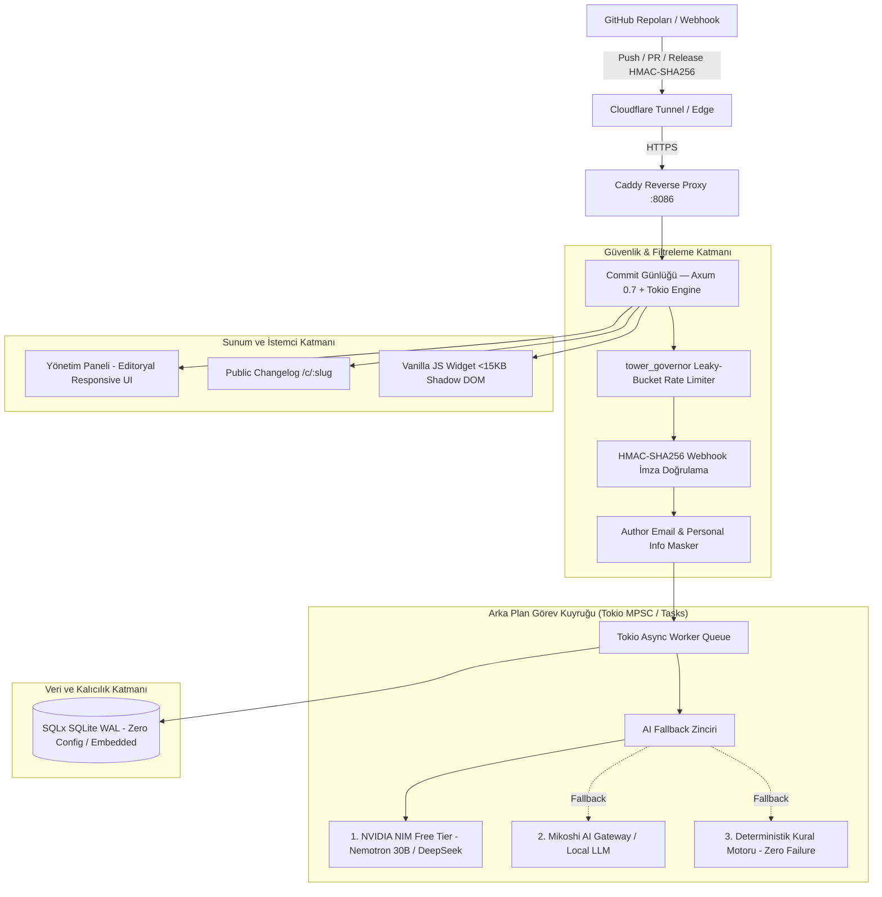

# Commit Günlüğü — Rust (Axum) Dönüşümü & GitHub Developer Program Entegrasyon Planı

Bu belge, **Commit Günlüğü** projesinin (`dixtuel/commit-gunlugu`) atıl/derlenmemiş Next.js + Prisma + BullMQ yapısından çıkarılarak, **Rust (Axum + Tokio + SQLx)** mimarisine geçirilmesi ve **GitHub Developer Program** resmi üyeliğinin kazanılması için hazırlanmış kapsamlı dönüşüm ve mimari planıdır.

---

## 1. GitHub Developer Program Resmi Şartları ve Yol Haritası

GitHub Developer Program, GitHub API'sini ve ekosistemini aktif olarak kullanan geliştiricilere özel resmi bir rozettir.

### 1.1. Resmi Şartlar
1. **2FA ve Doğrulanmış E-posta:** Geliştirici hesabında aktif iki faktörlü kimlik doğrulama ve doğrulanmış birincil e-posta adresi bulunmalıdır (*Asrın Kılıç / dixtuel hesabında zaten mevcuttur ve aktiftir*).
2. **Kayıtlı GitHub App veya OAuth App:** Hesaba bağlı en az bir adet aktif, GitHub API'si ile entegre çalışan uygulama bulunmalıdır.
3. **Kayıt Formunun Onayı:** [github.com/settings/developer_program](https://github.com/settings/developer_program) sayfasından başvuru onaylandığında **Developer Program Member** rozeti profile anında işlenir.

### 1.2. Neden "Commit Günlüğü"?
Commit Günlüğü, GitHub Webhook'ları (`push`, `pull_request`, `release`) ve GitHub REST API'sini (`/repos/{owner}/{repo}/commits/{sha}`) merkezine alan bir üründür. Bu nedenle GitHub Developer Program için en meşru ve kusursuz adaydır.

### 1.3. GitHub App Yapılandırma Spesifikasyonu
- **Uygulama Adı:** `Commit Günlüğü` (veya `Commit Gunlugu Changelog`)
- **Homepage URL:** `https://commit.dixtuel.tr`
- **Webhook URL:** `https://commit.dixtuel.tr/api/v1/webhook`
- **Webhook Secret:** Rastgele üretilmiş 64 karakterli yüksek entropili gizli anahtar
- **Gerekli İzinler (Permissions):**
  - `Repository Contents`: Read-only (Commit diff ve commit mesajlarını okumak için)
  - `Pull requests`: Read-only (PR başlık, etiket ve açıklama içeriklerini okumak için)
  - `Metadata`: Read-only (Temel repo bilgileri, varsayılan açık)
- **Olay Abonelikleri (Subscribe to events):**
  - `Push`
  - `Pull request`
  - `Release`

---

## 2. Neden Rust (Axum + Tokio)? (Next.js & Python Karşılaştırması)

Mevcut depoda bulunan Next.js + Prisma + BullMQ + Redis + PostgreSQL yığını henüz kurulmamış ve VDS üzerinde doğrulanmamıştır.
- **Bellek ve Kaynak Tüketimi:** Next.js + Node.js + Prisma motoru arka planda ~350-500 MB RAM tüketir. Python (FastAPI/Celery) ise ~200-300 MB tüketir. Buna karşılık `randomservice` projesinde kanıtlandığı üzere Rust (Axum 0.7 + Tokio + SQLx SQLite WAL) sadece **12-18 MB RAM** ile çalışır.
- **Güvenlik ve Tip Garantisi:** Derleme anında bellek güvenliği, sıfır maliyetli soyutlama ve SQLx ile derleme anında SQL injection bağışıklığı.
- **Webhook İşleme Hızı:** GitHub webhook'larını sub-millisecond (<1ms) sürede karşılayıp 200 OK döner, AI özetleme görevini arka plandaki hafif Tokio task'larına devreder.

---

## 3. Sistem Mimarisi



---

## 4. Temel Bileşenler ve Tasarım Detayları

### 4.1. Askıya Alınan Bileşenler (MVP Sadeleştirmesi)
- **Stripe & Faturalandırma:** `stripeCustomerId`, `stripeSubscriptionId`, `Plan` (SOLO, AGENCY, STUDIO) modelleri ve ödeme webhook'ları askıya alınmıştır. Kod tabanında karmaşıklık yaratmaması için tamamen temizlenecektir.
- **Harici Redis & BullMQ:** Ayrı bir Redis veritabanı gereksinimi kaldırılmış; yerine Tokio `tokio::sync::mpsc` tabanlı hafif yerel arka plan iş kuyruğu entegre edilmiştir.

### 4.2. Çok Katmanlı AI Fallback & Prompt Zinciri (`randomservice` Standardı)
`randomservice/src/llm/nvidia_client.rs` yapısına benzer şekilde dayanıklı model zinciri:
1. **Birincil Model:** `nvidia/nemotron-3.5-lightning-30b-a3b` veya `deepseek-ai/deepseek-v4-flash-0731` (Düşük gecikme, yüksek kavrayış).
2. **İkincil Model (Fallback):** Mikoshi AI Gateway (`gateway.mikoshi.internal` / LiteLLM uyumlu).
3. **Üçüncül Motor (Deterministik Kural Motoru):** İnternet veya LLM servisleri tamamen çökse dahi sistem durmaz. Commit mesajlarındaki Conventional Commits kurallarını (`feat:`, `fix:`, `chore:`, `refactor:`) ayrıştırarak kusursuz bir taslak changelog oluşturur.

**Örnekleme ve Parametreler:**
- `temperature`: `0.1` (Changelog üretimi editoryal tutarlılık gerektirdiği için deterministik düşük sıcaklık).
- `top_p`: `0.9`
- `max_tokens`: `1024`
- Yapılandırılmış JSON Çıktısı:
  ```json
  {
    "category": "NEW" | "FIX" | "IMPROVEMENT",
    "title": "Kısa, kullanıcı odaklı başlık",
    "body": "Markdown formatında 2-3 cümlelik açıklama",
    "highlights": ["Öne çıkan teknik veya kullanıcı odaklı kazanım 1", "Kazanım 2"]
  }
  ```

### 4.3. Güvenlik, DDoS, Brute-Force ve SQL Injection Koruması
- **HMAC-SHA256 Doğrulaması:** GitHub'ın `X-Hub-Signature-256` başlığı, payload gövdesiyle birlikte `ring::hmac` kullanılarak doğrulanır. Zamanlama saldırılarını önlemek için sabit zamanlı karşılaştırma (`subtle::ConstantTimeEq`) zorunludur.
- **DDoS & Brute-Force Koruması:** `tower_governor` ara katmanı ile Leaky-Bucket algoritması:
  - Webhook uç noktası: Dakikada 60 istek tavanı.
  - Widget ve Public API uç noktası: IP başına dakikada 30 istek tavanı.
  - Cloudflare arkasında gerçek istemci IP tespiti (`CF-Connecting-IP`).
- **SQL Injection Bağışıklığı:** SQLx derleme zamanı tip kontrolü ve parametreli sorgular (`sqlx::query!`).
- **Token Şifreleme:** GitHub App Private Key ve webhook secret'ları AES-256-GCM ile şifrelenerek saklanır.

### 4.4. Gizlilik ve Kimlik Maskeleme (Privacy & Data Sanitization)
- **Email Asla Sızdırılmaz:** Webhook payload'ında gelen `author.email` ve `committer.email` alanları işleme anında ayıklanır ve silinir.
- **Kişisel Veri Ayrımı:** Public changelog (`/c/:slug`) veya widget API'sinde yalnızca repo adı, sürüm/etiket, kategori, başlık, özet ve varsa GitHub genel kullanıcı adı (`@username`) yer alır. Kişisel e-postalar veya iç sunucu IP adresleri halka açık yanıtlara kesinlikle dahil edilmez.

### 4.5. Kullanıcı Arayüzü ve Gömülebilir Widget (<15KB)
- **Duyarlı (Responsive) Tasarım:** Mobil, tablet ve masaüstünde kusursuz çalışan minimalist, modern karanlık/aydınlık mod uyumlu editoryal tasarım.
- **Yönetim Paneli (`/dashboard`):** Gelen webhook commit'lerini listeleme, AI tarafından oluşturulmuş taslakları (DRAFT) inceleme, tek tıkla düzenleme ve yayınlama (PUBLISH).
- **Public Changelog Sayfası (`/c/:slug`):** Beyaz-etiketli, özel marka renklerini destekleyen hızlı statik/SSR changelog sayfası.
- **Gömülebilir Widget (`widget.js`):**
  - Shadow DOM mimarisiyle ana sitenin CSS stillerinden izole.
  - Gzip sonrası <15KB boyut.
  - Basit bir `<script src="https://commit.dixtuel.tr/widget.js" data-key="xxx"></script>` etiketiyle herhangi bir web sitesine eklenebilen "Yenilikler" rozeti ve açılır modalı.

---

## 5. Dizin ve Dosya Yapısı (Rust Projesi)

```text
/opt/commit-gunlugu/
├── Cargo.toml
├── .env.example
├── README.md
├── docs/
│   ├── ARCHITECTURE.md
│   ├── DEPLOYMENT.md
│   └── PLAN.md
├── migrations/
│   └── 20260913000001_init.sql
├── src/
│   ├── config.rs              # Ortam değişkenleri ve yapılandırma
│   ├── error.rs               # Birleşik hata tipleri (AppError)
│   ├── main.rs                # Sunucu başlatıcı ve graceful shutdown
│   ├── state.rs               # Paylaşılan uygulama durumu (DB havuzu, LLM istemcisi)
│   ├── crypto/
│   │   ├── hmac.rs            # GitHub Webhook HMAC-SHA256 doğrulaması
│   │   └── encrypt.rs         # AES-256-GCM token şifreleme
│   ├── db/
│   │   ├── mod.rs             # SQLx SQLite havuzu ve migration koşucusu
│   │   └── models.rs          # Proje, Entry, WebhookEvent modelleri
│   ├── llm/
│   │   ├── mod.rs
│   │   ├── client.rs          # NVIDIA NIM & Mikoshi AI fallback istemcisi
│   │   ├── deterministic.rs   # Kural tabanlı yedek özetleyici
│   │   └── prompts.rs         # Changelog sistem ve kullanıcı promptları
│   ├── middleware/
│   │   ├── mod.rs
│   │   ├── rate_limit.rs      # tower_governor IP hız kısıtlayıcı
│   │   └── security.rs        # Güvenlik başlıkları (CSP, HSTS, X-Frame)
│   ├── routes/
│   │   ├── mod.rs
│   │   ├── api.rs             # /api/v1/widget, /api/v1/entries
│   │   ├── dashboard.rs       # /dashboard yönetim rotaları
│   │   ├── public.rs          # /c/:slug herkese açık changelog
│   │   └── webhook.rs         # /api/v1/webhook GitHub olay yakalayıcı
│   └── worker/
│       └── processor.rs       # Arka plan commit işleme ve AI görevi
├── static/
│   ├── css/
│   │   └── style.css          # Responsive modern minimalist CSS
│   └── js/
│       ├── app.js             # Dashboard interaktivitesi
│       └── widget.js          # Gömülebilir Vanilla JS Shadow DOM widget'ı (<15KB)
└── templates/                 # Askama veya Minijinja HTML şablonları
    ├── base.html
    ├── changelog.html
    └── dashboard.html
```

---

## 6. Uygulama ve Doğrulama Adımları

1. **Rust Projesinin İskeletinin Kurulması:**
   - `Cargo.toml` bağımlılıklarının (`axum`, `tokio`, `sqlx`, `tower-governor`, `serde`, `reqwest`, `ring`, `minijinja`) tanımlanması.
   - Atıl Next.js, Prisma ve Stripe dosyalarının temizlenmesi.
2. **Veritabanı Şeması ve Modeller:**
   - SQLite WAL şemasının oluşturulması (`projects`, `entries`, `webhook_events`).
   - SQLx migration'larının hazırlanması.
3. **Güvenlik ve Webhook İşleme Motoru:**
   - Sabit zamanlı HMAC-SHA256 imza doğrulayıcısının kodlanması.
   - `push` ve `pull_request` payload ayrıştırıcısı (Author email ayıklama ve gizleme mantığı dahil).
4. **AI Fallback Motoru:**
   - `randomservice` benzeri NVIDIA NIM + Local LLM + Kural tabanlı 3 aşamalı fallback motorunun kurulması.
5. **Arayüz ve Widget:**
   - Responsive modern HTML/CSS şablonlarının ve <15KB Shadow DOM widget'ının yazılması.
6. **Systemd Servisi ve Canlı Dağıtım:**
   - `commit-gunlugu.service` systemd biriminin oluşturulması.
   - Caddy / Cloudflare Tunnel üzerinde `commit.dixtuel.tr` yapılandırması.
7. **GitHub App Oluşturma & Developer Program Başvurusu:**
   - GitHub Developer Settings üzerinden App kurulumu, webhook secret'ın girilmesi.
   - [github.com/settings/developer_program](https://github.com/settings/developer_program) formunun onaylanması ve rozetin doğrulanması.
8. **Dokümantasyon:**
   - Canonical dokümanın `/root/mikoshi-vds-docs/projects/commit-gunlugu.md` olarak işlenmesi ve Git senkronizasyonu.
